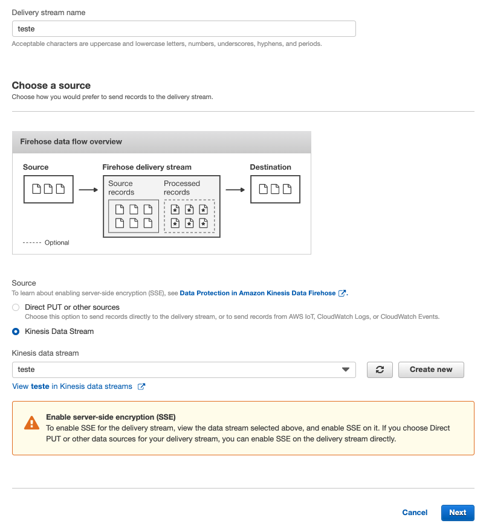

# Tutorial palestra Serverless Big Data


1. Crie o bucket que receberá os dados. Para isso no console da AWS vá até o serviço S3 e clique em `Criar Bucket`
2. De um nome ao seu bucket e clique em `Criar Bucket`
   
3. Agora vamos criar o streaming do Kinesis, para isso vá até o serviço no console aws, clique em `Create data Stream`
   
4. De o nome de 'teste' e o número '1' em shards como na imagem como na imagem e clique em `Create Kinesis stream`
   
5. No seu terminal baixe o repositório git `git clone https://github.com/vamperst/demo-serverless-bigdata-talk.git`
6. Entre na pasta `demo-serverless-bigdata-talk/lambda`
7. Caso não tenha Serverless Framewaork baixe utilizando o comando `npm install -g serverless`
8. Execute o comando `sls deploy` para fazer o deploy dessa função que será responsável para que cada entrada do Kinesis fique em uma linha de arquivo no S3.
   
9.  Agora vamos criar o Kinesis firehose. No menu lateral clique em `Data Firehose`. E após clique em `Create Delivery Stream`.
   
10. Coloque 'teste' no nome do Stream, em source escolha `kinesis data stream` e na lista escolha o streaming teste que acabou de criar. CLique em 'next'
    
11. Selecione 'Enabled' em 'Transform source records with AWS Lambda' e selecione a lambda que acabou de criar 'demo-bigdata-dev-transform'. Clique em 'next'.
    
12. Em 'Select a destination' escolha `Amazon s3` e selecione o bucket que criou.
    
13. Ainda na mesma pagina em 'S3 backup' escolha o mesmo bucket. Clique em 'next'.
    
14. Em `S3 buffer conditions` coloque o valor 1 em `Buffer size` e 60 em `Buffer interval`
15. No final da pagina em `Permissions` clique em `Create new or choose`
16. Ta tela que abrir apenas clique em permitir no canto inferior direito.
17. Clique em `Next`
18. Revise as informações e clique em `Create delivery stream`
19. Devolta a seu terminal volte a pasta que acabou de baixar do github `demo-serverless-bigdata-talk` 
20. Execute o comando `python3 put.py` e deixe rodando. Esse script que irá mandar dados para seu kinesis stream enviando várias vezes o conteudo do arquivo `company_funding.csv`.
21. Espere alguns minutos e olhe se o conteudo do streaming esta chegando no s3 que criaram. Vai ficar organizado por data YYYY/MM/dd.
     
22. Agora vamos habilitar a leiturado serviço Athena no bucket criado.
23. No query editor execute o seguinte comando, substituindo `<nomedoseubucket>` pelo nome do bucket que criou:
    ```

      CREATE DATABASE demo;

      CREATE EXTERNAL TABLE IF NOT EXISTS demo.companyfunding (
      permalink	STRING,
      company STRING,
      numEmps INT,
      category STRING,
      city STRING,
      state STRING,
      fundedDate STRING,
      raisedAmt	INT,
      raisedCurrency STRING,
      round STRING
      )
      ROW FORMAT SERDE 'org.apache.hadoop.hive.serde2.lazy.LazySimpleSerDe'
      WITH SERDEPROPERTIES (
      'serialization.format' = ',',
      'field.delim' = ','
      ) 
      LOCATION 's3://<nomedoseubucket>/';
    ```
    

24. Com o editor vazio execute a query:
   ```
      SELECT * from demo.companyfunding LIMIT 20;
   ```
   
25. Com o editor vazio execute a query, se esperar um minuto entre as execuções dessa query verá que o numero aumenta porque continuam entrando informações no Kinesis:
   ```
      SELECT count(*) from demo.companyfunding;
   ```
   
